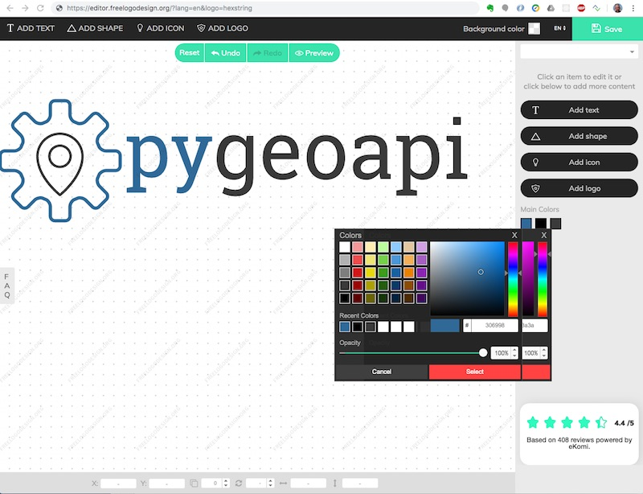

# pygeoapi logo

The `pygeoapi` logo was created on August 21, 2019 on https://www.freelogodesign.org by [justb4](https://github.com/justb4).
The design files can be found in the subdirs below. Usable logo files can be found under [static](../static).

## Result

### Logo

### Icon

## Design

In theory it is possible to recreate the logo, or a color-variant, but the freelogodesign.org session is one-time (with payment) only.

Below a screenshot of the design session.

Within this session one can mix icons and texts, hundreds of icons are available (via search) The logo was created as follows:

* provide text, choose domain "Technology"
* ignore all suggestions, start a fresh logo with just text
* text: "pygeoapi", selected the `RoboSlab Regular` Font
* icon 1: search for a `cog` or `cogwheel` icon (there are hundreds available) until you find one without a circle internally
* icon 2: search for a `marker` icon 
* place the marker icon within the cogwheel icon
* colors: blue is "Python logo blue": hex `#306998` and "black" is grayish: `#3a3a3a`.
* ensure result has transparency
* saved and paid EUR 34,-, received .zip file with designs SVGs various resolutions shortly after that
* NB the square `pygeoapi` icon was cut off manually (in Preview Mac)
* also favicons need to be created manually
